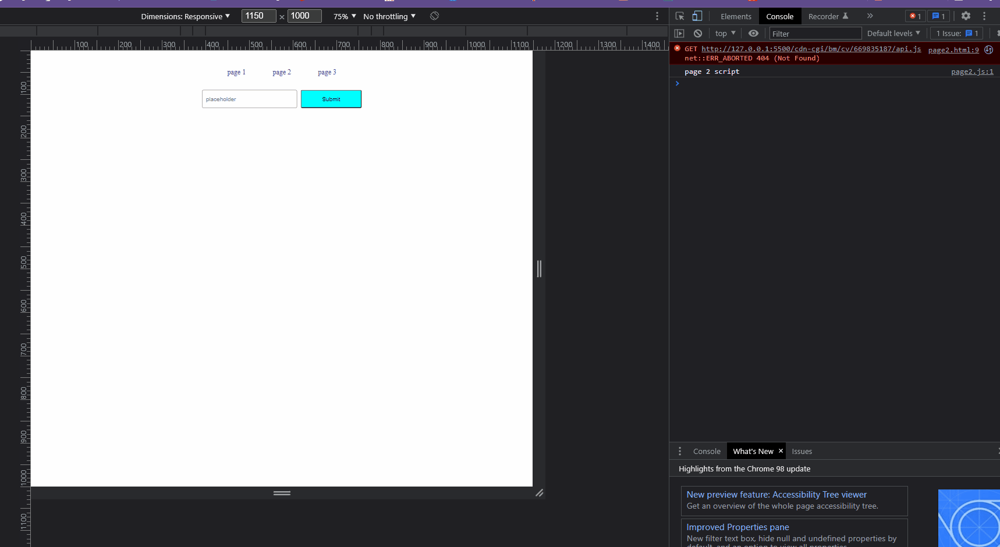

# Flask-RESTful

Flask-RESTful provides the building blocks for creating a great REST API.

## User Guide

You'll find the user guide and all documentation [here](https://flask-restful.readthedocs.io/)

## Jiramed's Guide

1. Go to `.Term_Project/openfile.py` and run, to get the .pkl file of vertorizer, and group of fit ranks (tf, tf-idf and bm25)
2. Run back-end `.Term_Project/Rest_Api.py` default port is :5000
3. Run live server `.Term_Project/template/index.html` default port is :5500

## Example `TF` `TF-IDF` `BM25`

## Example `Search Song`

